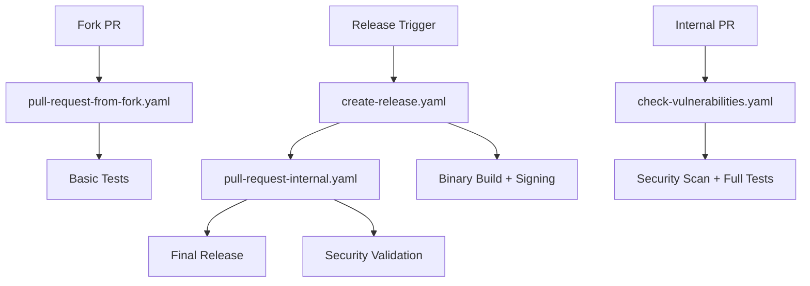

# Contributing to Adele Framework

## Table of Contents

- [Quick Start](#quick-start)
- [Development Workflow](#development-workflow)
- [Testing](#testing)
- [Security](#security)
- [Release Process](#release-process)
- [GitHub Actions Workflows](#github-actions-workflows)
- [Getting Help](#getting-help)

## Quick Start

### Prerequisites

- Go 1.21 or later
- Git
- Docker Desktop (for integration tests)

### Setup

```bash
# Fork the repository (external contributors)
# Or clone directly (internal contributors)
git clone https://github.com/cidekar/adele-framework.git
cd adele-framework

# Install dependencies
go mod download

# Run tests
go test ./...
```

## Development Workflow

Adele Framework uses a dual-track contribution system designed to maintain security while welcoming community contributions.

### For External Contributors (Fork Workflow)

**Target Branch:** `development`

1. **Fork the Repository**

   - Click "Fork" on the main repository
   - Clone your fork locally

2. **Create Feature Branch**

   ```bash
   git checkout -b feature/your-feature-name
   ```

3. **Make Changes**

   - Write code following our conventions
   - Add tests for new functionality
   - Update documentation as needed

4. **Submit Pull Request**

   - Push to your fork
   - Create PR targeting `development` branch
   - **Automated testing runs** via `pull-request-from-fork.yaml`
   - Basic tests only (no secret access for security)

5. **Review and Merge**
   - Maintainer review
   - Feedback incorporation
   - Merge to `development`

### For Internal Contributors (Direct Access)

**Target Branch:** `development`

1. **Create Feature Branch**

   ```bash
   git checkout development
   git pull origin development
   git checkout -b feature/your-feature-name
   ```

2. **Development Process**

   - Same as external contributors
   - Full access to testing infrastructure

3. **Submit Pull Request**

   - Create PR to `development`
   - **Full security scanning** runs via `check-vulnerabilities.yaml`
   - Nancy vulnerability scanning with authentication
   - Complete test suite including integration tests

4. **Review and Merge**
   - Security scan results reviewed
   - Code review by maintainers
   - Merge to `development`

## Testing

### Test Categories

**Unit Tests**

```bash
go test ./...
```

**Integration Tests** (requires Docker)

```bash
# Full test suite including container tests
go test -v ./...

# Skip container tests if Docker unavailable
go test -short ./...
```

**Security Scanning**

- Automated via Nancy (OSS Index vulnerability scanning)
- OWASP input sanitization validation
- Dependency vulnerability checks

### Test Requirements

- All new code must include tests
- Integration tests for database/cache functionality
- Security tests for input validation
- Container tests may be skipped in CI for external contributors

## Security

### Input Sanitization

All user input must be sanitized using the framework's built-in functions:

```go
// Comprehensive sanitization (recommended)
cleanInput := h.Sanitize(userInput)

// Specific protections
xssClean := h.CleanXSS(htmlInput)
pathClean := h.CleanPathTraversal(filename)
injectionClean := h.CleanInjection(dbInput)
```

### Vulnerability Scanning

- **Automatic**: All internal PRs scanned via Nancy
- **Manual**: Contributors can run `nancy sleuth` locally
- **Authenticated scanning**: Higher rate limits for thorough checks

### OWASP Protection

The framework provides protection against:

- Cross-Site Scripting (XSS)
- SQL/NoSQL Injection
- LDAP Injection
- Path Traversal
- Code Injection

## Release Process

The complete journey from development to production release:

### 1. Development Phase

```
Contributors → PRs → development branch
├── Fork PRs: Basic testing (no secrets)
└── Internal PRs: Full security scanning + tests
```

### 2. Pre-Release

````bash
# Trigger release preparation (maintainers only)
# This can be done via GitHub Actions UI or github tag however we maintain a Makefile for convenience.
# Run ```make release:help``` for more information commans, format, triggers and automation.
$ make release:help

═══════════════════════════════════════════════════════════════════
                        RELEASE WORKFLOW HELP
═══════════════════════════════════════════════════════════════════

📋 AVAILABLE COMMANDS:
  make release:help     - Show this help documentation
  make release:pull     - Pull latest changes from origin
  make release:verify   - Verify and create release tag (interactive)
  make release          - Run pull + verify in sequence

🏷️  SEMANTIC VERSIONING FORMAT:
  Tags must follow: vMAJOR.MINOR.PATCH[-prerelease][+buildmeta]

  🚀 WORKFLOW TRIGGERS (these will trigger GitHub Actions):
    v1.0.0-rc                 - Basic release candidate
    v1.0.0-rc.1               - Release candidate iteration
    v1.0.0-rc.beta            - Release candidate with label
    v1.0.0-rc+build.123       - RC with build metadata
    v1.0.0-rc.1+sha.abc123    - RC iteration with git hash
    v10.21.34-rc              - Multi-digit RC versions
````

### 3. Release Automation

When a release is triggered, the following happens automatically:

1. **Security Scan** (`check-vulnerabilities.yaml`)

   - Full Nancy vulnerability scan
   - OWASP compliance check
   - Dependency analysis

2. **Release PR Creation** (`create-release.yaml`)

   - Creates PR from `development` to `main`
   - Includes release notes and version bumping
   - Triggers additional security validation

3. **Final Security Check** (`pull-request-internal.yaml`)
   - Last security scan before production
   - Comprehensive testing suite
   - Artifact preparation

### 4. Production Release

```
main branch ← development (via release PR)
├── Final review by maintainers
├── Merge to main
├── Automatic tagging
├── Binary compilation
├── Code signing (macOS)
└── Release artifact publication
```

### 5. Post-Release

- GitHub release creation with artifacts
- Documentation updates
- Version bump for next development cycle

## GitHub Actions Workflows

### `pull-request-from-fork.yaml`

**Triggers:** PRs to `development` from forks
**Purpose:** Safe testing of external contributions
**Features:**

- Basic Go testing
- No secret access (security isolation)
- Self-hosted macOS ARM64 runner
- Act-compatible for local testing

### `check-vulnerabilities.yaml`

**Triggers:** Internal PRs, manual dispatch, repository dispatch
**Purpose:** Comprehensive security scanning
**Features:**

- Nancy vulnerability scanning (authenticated)
- OSS Index integration (10,000 req/hour limit)
- Detailed security reporting
- PR comment integration

### `pull-request-internal.yaml`

**Triggers:** Release PRs to `main`
**Purpose:** Internal release management
**Features:**

- Release PR automation
- Security scan orchestration
- Cross-workflow communication

### `create-release.yaml`

**Triggers:** Manual dispatch, tags
**Purpose:** Release preparation and execution
**Features:**

- Binary compilation
- Code signing
- Artifact generation
- GitHub release creation

## Workflow Architecture



## Branch Strategy

- **`main`**: Production-ready code, protected branch
- **`development`**: Integration branch for all features
- **`feature/*`**: Individual feature development
- **`release/*`**: Release preparation (if needed)

## Code Standards

### Go Conventions

- Follow standard Go formatting (`go fmt`)
- Use meaningful variable names
- Include comprehensive error handling
- Document exported functions and types

### Security Requirements

- Sanitize all user inputs
- Use framework validation functions
- Follow OWASP guidelines
- Test security features thoroughly

### Git Commit Messages

```
feat: add user authentication system
fix: resolve memory leak in cache layer
docs: update API documentation
test: add integration tests for database
security: implement input sanitization
```

## Local Testing

### Test Workflow Locally with Act

```bash
# Install act (if not already installed)
brew install act

# Test fork workflow
act pull_request -W .github/workflows/pull-request-from-fork.yaml

# Test security workflow (requires secrets)
echo "OSS_INDEX_USERNAME=user" >> .secrets
echo "OSS_INDEX_TOKEN=token" >> .secrets
act workflow_dispatch -W .github/workflows/check-vulnerabilities.yaml --secret-file .secrets
```

### Skip Container Tests

If Docker is unavailable or causing issues:

```bash
# Skip integration tests
go test -short ./...

# Or set environment variable
export SKIP_CONTAINER_TESTS=true
go test ./...
```

## Getting Help

### Issues and Questions

- **Bug reports**: Use GitHub Issues with bug template
- **Feature requests**: Use GitHub Issues with feature template
- **Security concerns**: Email maintainers directly
- **General questions**: GitHub Discussions

### Development Support

- Check existing issues and PRs first
- Include minimal reproduction cases
- Provide Go version and OS information
- Reference relevant workflow runs

### Contributing Guidelines

- Read this document thoroughly
- Start with small contributions
- Ask questions early and often
- Be patient with the review process

---

## Summary: Code Journey

```
External Fork → development → Security Scan → Release PR → main → Tagged Release
     ↓              ↓              ↓             ↓         ↓         ↓
Basic Tests → Full Tests → Nancy Scan → Final Review → Merge → Artifacts
```

Every contribution follows this path, ensuring security, quality, and proper release management while maintaining an open and welcoming contribution process.

**Questions?** Open a GitHub Discussion or reach out to the maintainers.

---

**Last Updated:** September 2025
**Framework Version:** v1.x.x
